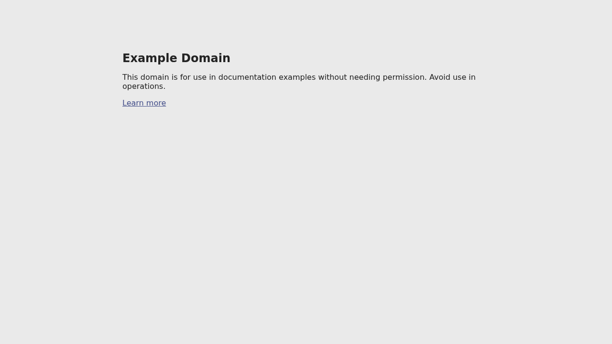

# 📸 Web Capture Studio

**Web Capture Studio** is a premium, high-performance web application designed for developers, designers, and marketers who need high-quality website captures. Whether you need a simple screenshot or a smooth, high-resolution scrolling video, Web Capture Studio provides a professional-grade interface to generate and export assets in seconds.



## 🚀 Key Features

- **Multi-Device Snapshots:** Generate high-fidelity screenshots for Desktop, Tablet, and Mobile viewports simultaneously.
- **Dynamic Video Generation:** Create smooth, high-quality scrolling videos of any website using advanced browser automation.
- **Social Media Presets:** Perfectly sized templates for Instagram (Story/Post), LinkedIn, Twitter (X), and YouTube.
- **Advanced Customization:**
  - Full-page or viewport-specific captures.
  - Dark mode / Light mode toggling.
  - Cookie banner suppression.
  - Custom scroll speeds and delays.
  - Retina/High-DPI support.
- **Batch Export:** One-click ZIP download for all generated images and videos.
- **Responsive Preview:** Real-time grid view of all generation tasks and their statuses.

## 🛠️ Technology Stack

- **Frontend:** [React 19](https://react.dev/) + [Vite](https://vitejs.dev/)
- **Styling:** [Tailwind CSS](https://tailwindcss.com/) + [Framer Motion](https://www.framer.com/motion/)
- **State Management:** [Zustand](https://github.com/pmndrs/zustand)
- **Backend/Functions:** [Netlify Functions](https://www.netlify.com/products/functions/) (Node.js)
- **Core APIs:**
  - [ScreenshotOne](https://screenshotone.com/) for pixel-perfect image and video rendering.

## ⚙️ Setup & Installation

### Prerequisites

1.  **ScreenshotOne API Key:** Get it at [screenshotone.com](https://screenshotone.com).

### Local Development

1.  **Clone the repository:**
    ```bash
    git clone https://github.com/leosenderovsky/Web-Capture-Studio.git
    cd Web-Capture-Studio
    ```

2.  **Install dependencies:**
    ```bash
    npm install
    ```

3.  **Configure environment variables:**
    Create a `.env` file in the root directory:
    ```env
    SCREENSHOTONE_ACCESS_KEY=your_access_key_here
    SCREENSHOTONE_SECRET_KEY=your_secret_key_here (optional)
    ```

4.  **Run the development server:**
    ```bash
    npm run dev
    ```
    Access the app at `http://localhost:5173`.

## 🌐 Deployment

This project is optimized for deployment on **Netlify**.

1.  Push your code to GitHub/GitLab/Bitbucket.
2.  Connect your repository to Netlify.
3.  Add the environment variables (`SCREENSHOTONE_ACCESS_KEY`) in the Netlify Dashboard (**Site settings > Environment variables**).
4.  Netlify will automatically detect the `netlify.toml` and deploy the functions and frontend.

## 📁 Project Structure

```text
├── netlify/
│   └── functions/        # Serverless backend functions
├── src/
│   ├── components/       # Reusable UI components
│   ├── store/            # State management (Zustand)
│   ├── utils/            # Helper functions (Download, ZIP, etc.)
│   ├── App.tsx           # Main application entry point
│   └── main.tsx          # React hydration
├── index.html            # Entry HTML
├── netlify.toml          # Netlify configuration
└── package.json          # Dependencies and scripts
```

## 📄 License

This project is licensed under the Apache-2.0 License. See the `LICENSE` file for details.

---

Built with ❤️ for the modern web.
